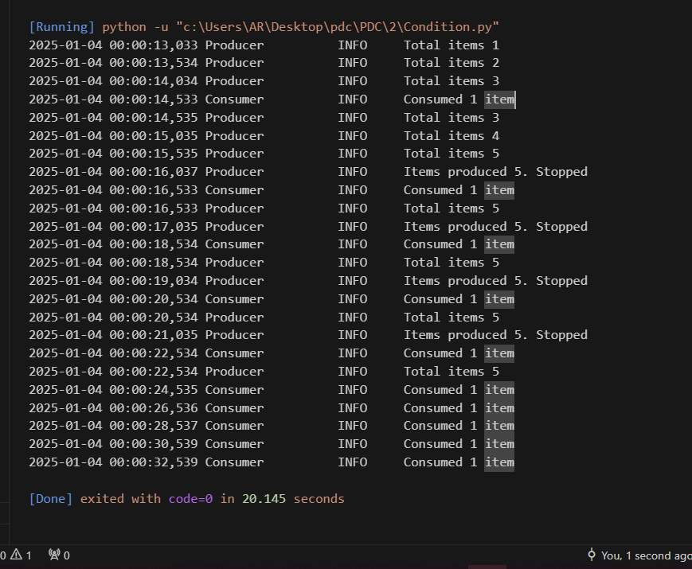

# Thread-Based Parallelism in Python

Welcome to the **Thread-Based Parallelism** project! This repository demonstrates thread-based parallelism concepts in Python using the `threading` module. It showcases various techniques for defining, managing, and synchronizing threads to build robust concurrent applications.

## Features
This project includes the following key implementations:

### 1. Thread Basics
- **What is a thread?**  
  Learn what threads are and why they are essential for parallelism in Python.
- **Defining and managing threads**  
  Understand how to create and manage threads for concurrent execution.
- **Determining the current thread**  
  Learn how to get the current active thread in a program.
- **Using threads in a subclass**  
  Explore the concept of subclassing the `Thread` class for custom threading behavior.
  

### 2. Thread Synchronization Techniques
- **Lock**  
  A synchronization tool ensuring that only one thread accesses a resource at a time.
  
- **RLock**  
  A reentrant lock allowing the same thread to acquire the lock multiple times.
  
- **Semaphore**  
  Limits concurrent access to a resource, useful for controlling access to a fixed number of resources.
  
- **Condition**  
  A mechanism for coordinating threads through `wait` and `notify` methods, ensuring proper synchronization.
  
- **Event**  
  A signaling mechanism for thread coordination, allowing threads to wait for a signal from another thread.
  
- **Barrier**  
  A synchronization point where threads must wait for others to reach the same point before continuing execution.
  

  

### 3. Thread Communication
- **Using a Queue for inter-thread communication**  
  Safe communication between threads using the `Queue` module, which avoids issues like data corruption and race conditions.
  

## Key Concepts Covered

### 1. Thread Management
- Learn to define, run, and manage threads effectively using the `threading` module. Gain an understanding of how threads work in Python and the fundamentals of managing their execution.

### 2. Thread Synchronization
- Avoid concurrency issues such as race conditions, deadlocks, and synchronization problems with tools like:
  - **Lock**: Ensures only one thread accesses a resource at a time.
  - **RLock**: Reentrant lock for threads requiring recursive access.
  - **Semaphore**: Limits concurrent access to a resource.
  - **Condition**: A wait-notify mechanism to coordinate threads.
  - **Event**: A signaling mechanism to alert threads.
  - **Barrier**: Synchronization point where threads must wait for others to reach before proceeding.

### 3. Thread Communication
- Use the `Queue` module to safely pass data between threads without manual synchronization, simplifying inter-thread communication.

