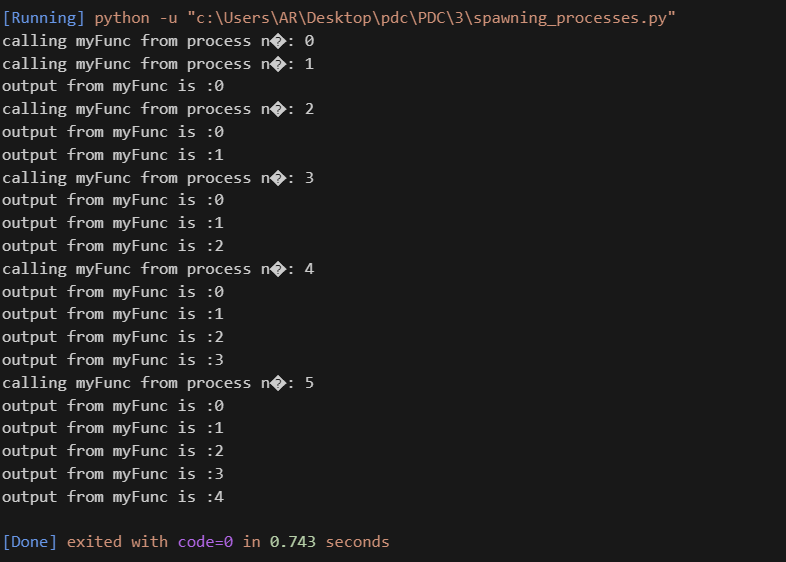
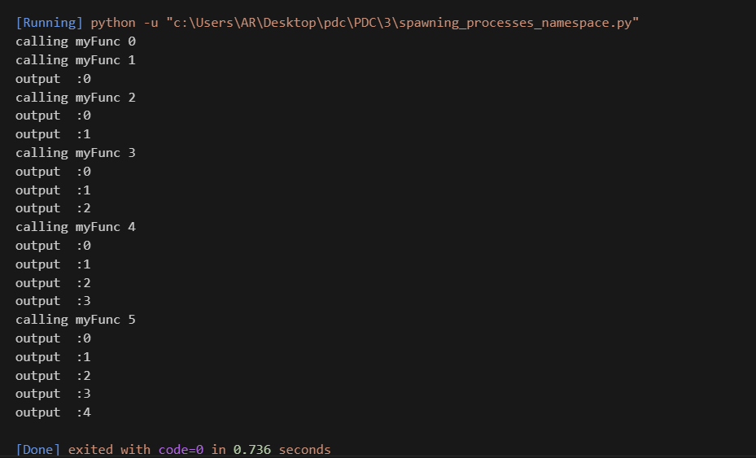
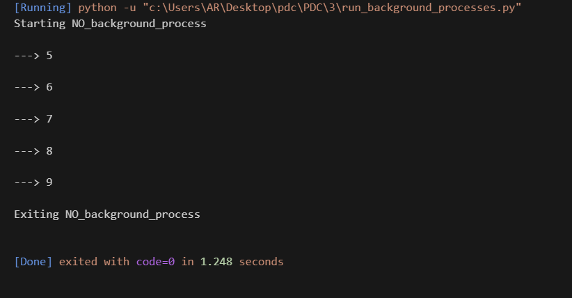
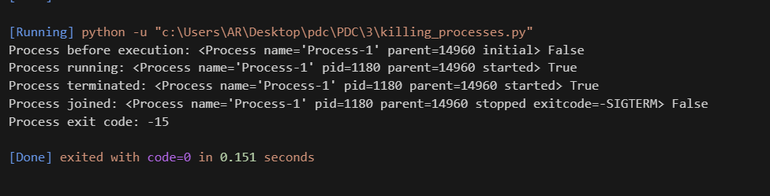
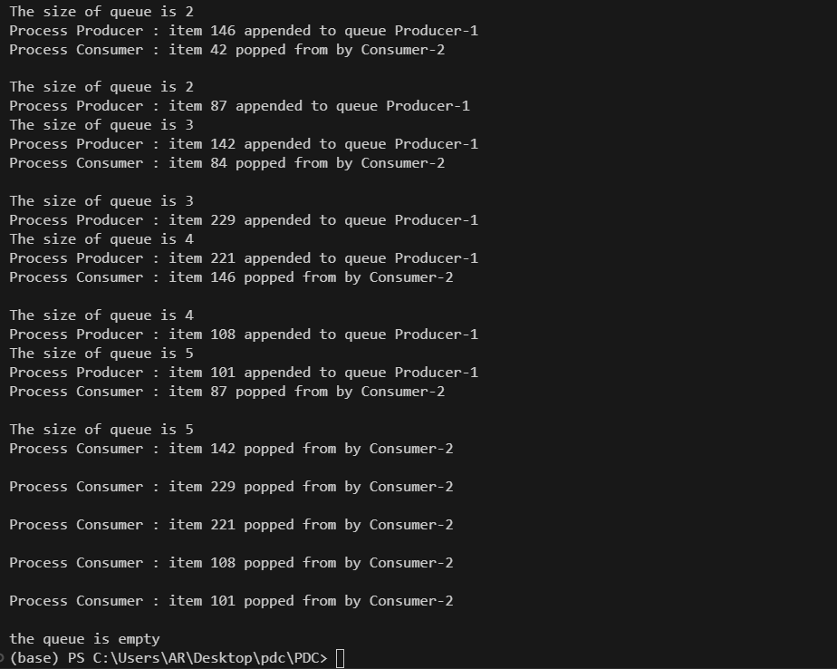
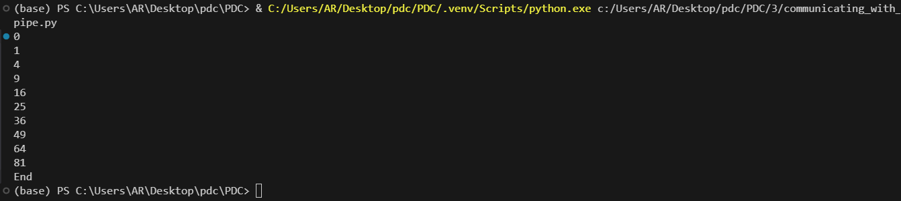
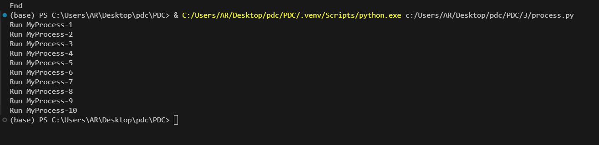
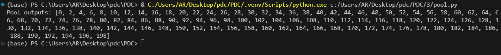
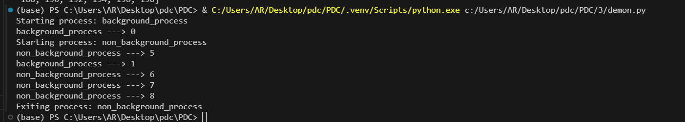

# Python Multiprocessing Guide

Welcome to the **Python Multiprocessing Guide** repository! This project provides a comprehensive overview of Python's `multiprocessing` module, which allows parallel processing by creating multiple processes that can share and communicate data efficiently.

## Key Concepts

### 1. Understanding Multiprocessing
- Learn how multiprocessing enables concurrent tasks in Python by running multiple processes in parallel, utilizing multiple CPU cores to enhance performance.

### 2. Process Operations
- **Spawning Processes**  
  Understand how to spawn new processes for concurrent execution.
  
- **Assigning Custom Names to Processes**  
  Assign meaningful names to processes for better debugging and management.
  
- **Running Processes in the Background**  
  Run processes as background tasks to avoid blocking the main thread.
  
- **Stopping Processes Gracefully**  
  Learn techniques to terminate processes without causing issues in the program.
  
- **Using Classes to Define Process Behavior**  
  Use object-oriented programming to define process behavior via class inheritance.

### 3. Communication Between Processes
- **Passing Objects via Queues**  
  Safely share data between processes using the `Queue` module.
  

- **Establishing Connections with Pipes**  
  Use `Pipe` objects to establish communication channels between processes.
  

### 4. Synchronization and State Management
- Learn techniques to synchronize multiple processes and manage shared states securely, preventing race conditions and data inconsistencies.

### 5. Process Pools
- **Utilizing Process Pools**  
  Efficiently handle repetitive tasks by using process pools to manage a group of worker processes.
  

### 6. Deamon process

