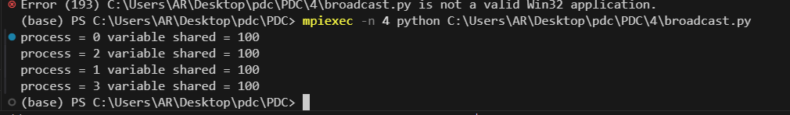
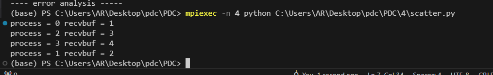
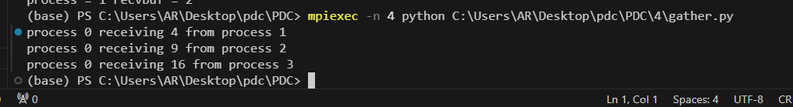
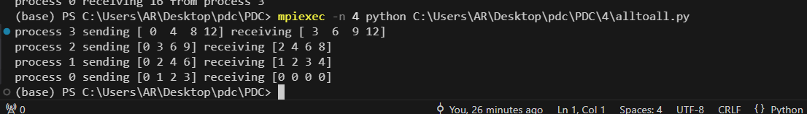
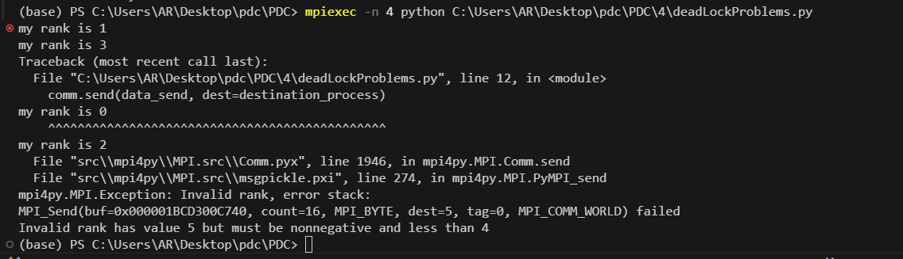
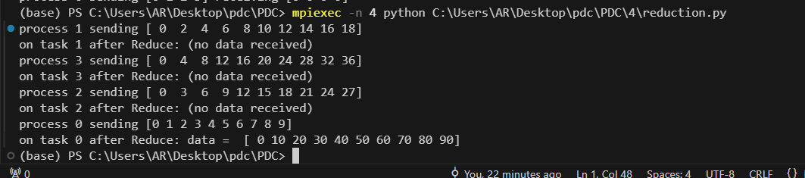

# MPI Programming with Python

This repository demonstrates the use of Message Passing Interface (MPI) concepts through Python's `mpi4py` library. It focuses on techniques for inter-process communication, synchronization, and optimization in distributed systems.

## Key Features

### Introduction to MPI
- Overview of MPI and its relevance in parallel computing.
- Setting up and utilizing the `mpi4py` library in Python.

### Point-to-Point Communication
- Direct message exchange between processes using `send` and `receive`.

### Collective Communication
- Broadcasting data (`broadcast`).

- Distributing data across processes (`scatter`).

- Gathering results from processes (`gather`).

- All-to-all communication (`alltoall`).

### Advanced Features
- Handling deadlock problems.

- Reduction operations (`reduce`) for aggregating results.

- Virtual topologies for process organization.

### Optimization
- Techniques for enhancing communication efficiency in distributed applications.