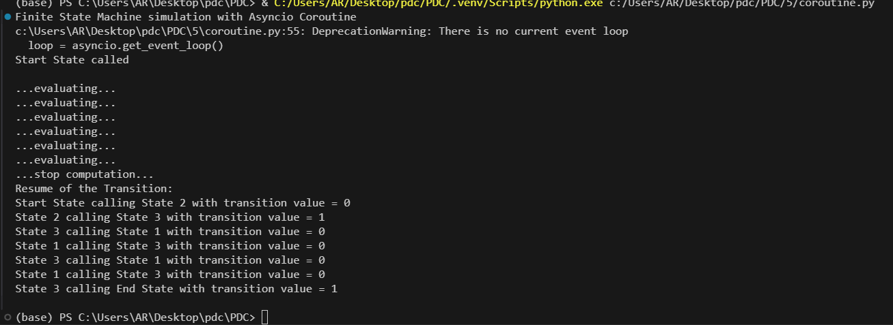
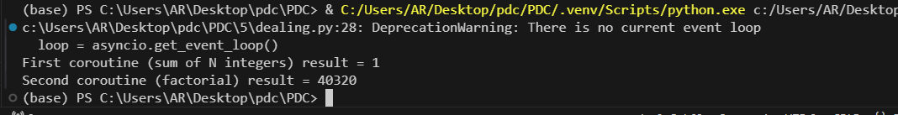
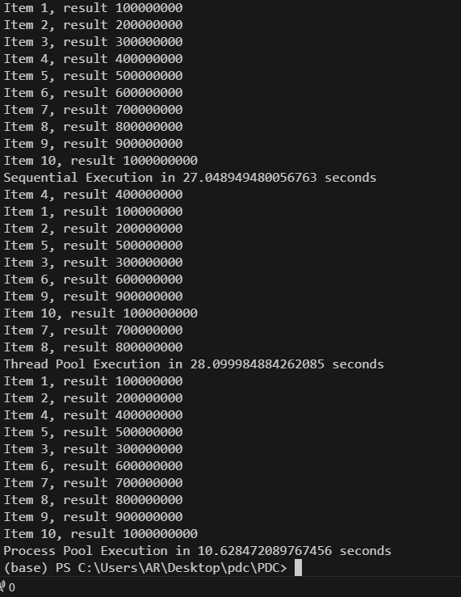
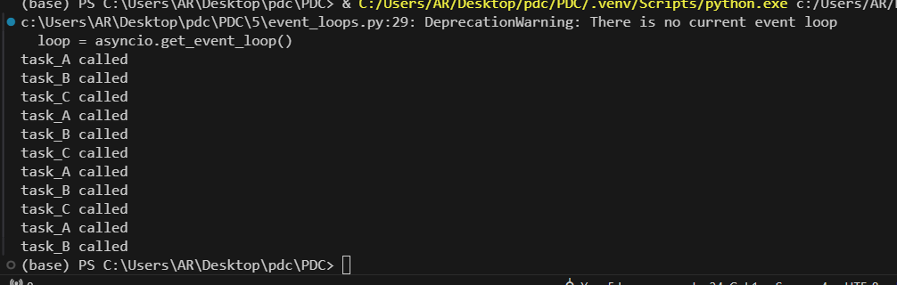
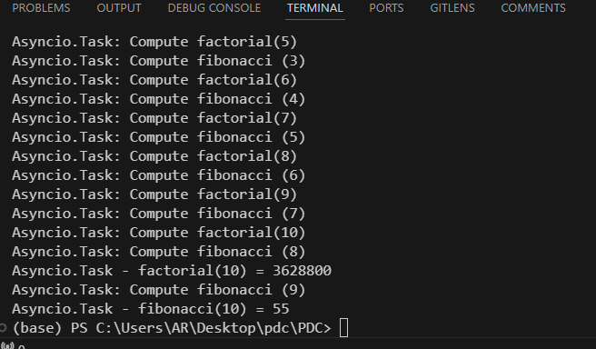

# Asynchronous Programming with Python

This repository provides examples of Asynchronous Programming using Python's `asyncio` and `concurrent.futures` modules. The focus is on understanding the asynchronous execution model and utilizing it to build efficient, single-threaded concurrent applications.

## Highlights

### 1. Core Concepts
- Introduction to asynchronous programming and the event-driven model.
- Differences between multithreaded and single-threaded asynchronous execution.
- Role of the coder in controlling the execution timeline.

### 2. Tools and Techniques
- **asyncio**: Managing event loops, tasks, and coroutines.
- **concurrent.futures**: Pooling resources and working with futures.

### 3. Efficiency and Optimization
- Task pooling with `ThreadPoolExecutor` and `ProcessPoolExecutor`.
- Reuse of threads/processes to minimize overhead.

### Co-routine:

### Dealing : 

### concurrent futures pooling : 

### event loop:

### manipulating Task :

